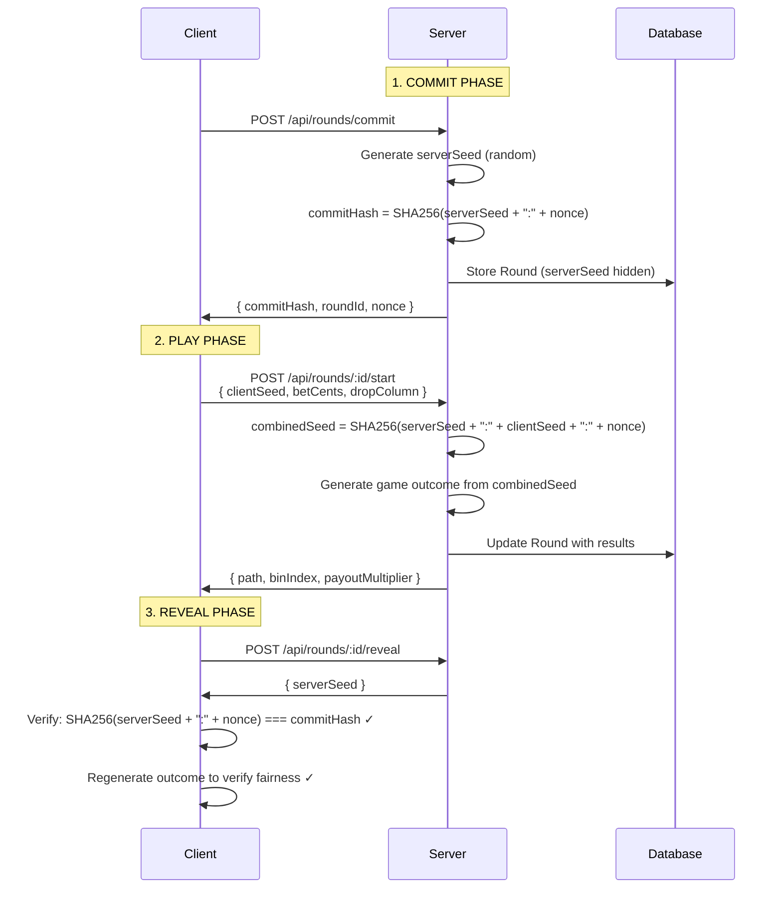

# 🎰 Plinko Lab - Provably Fair Game

A full-stack web application implementing a **provably-fair Plinko game** with deterministic outcomes using commit-reveal cryptography and xorshift32 PRNG.


**🎮 [Play Now](http://localhost:3000/play)** | **🔍 [Verify Results](http://localhost:3000/verify)**

---

## 📋 Table of Contents

- [Features](#features)
- [Tech Stack](#tech-stack)
- [Architecture](#architecture)
- [Setup Instructions](#setup-instructions)
- [How to Play](#how-to-play)
- [Provably Fair System](#provably-fair-system)
- [API Documentation](#api-documentation)
- [Project Structure](#project-structure)
- [Testing](#testing)
- [Deployment](#deployment)
- [License](#license)

---

## ✨ Features

### 🎲 Game Features

- **12-row Plinko board** with triangular peg layout (78 pegs total)
- **13 landing bins** with multipliers from 1.0x to 33.0x
- **Smooth ball animations** with realistic physics simulation
- **Sound effects** for peg hits, wins, and losses (Web Audio API)
- **Confetti celebration** for big wins (9x+ multipliers)
- **Round history** tracking last 10 games with statistics
- **Keyboard controls** (Arrow keys + Space/Enter)
- **Mobile responsive** design with adaptive board sizing

### 🔐 Fairness & Security

- **Provably-fair protocol** using commit-reveal scheme
- **SHA-256 cryptographic hashing** for seed commitment
- **xorshift32 deterministic PRNG** for reproducible outcomes
- **100% verifiable results** - players can audit every round
- **Server seed pre-commitment** before client input
- **Independent verification page** with test vectors

### 📊 User Experience

- **Real-time balance tracking** (starting at $1,000.00)
- **Quick bet buttons** for fast gameplay
- **Column selector** with visual feedback
- **Statistics dashboard** (win rate, total P/L, biggest win)
- **Mute toggle** for sound effects
- **Responsive layout** optimized for mobile/tablet/desktop

## 🛠️ Tech Stack

### Frontend

| Technology       | Version | Purpose                         |
| ---------------- | ------- | ------------------------------- |
| **Next.js**      | 16.0.1  | React framework with App Router |
| **React**        | 19.0.0  | UI library with hooks           |
| **TypeScript**   | 5.9.3   | Type-safe JavaScript            |
| **Tailwind CSS** | 4.1.16  | Utility-first CSS framework     |

### Backend

| Technology             | Version  | Purpose                   |
| ---------------------- | -------- | ------------------------- |
| **Next.js API Routes** | 16.0.1   | Serverless API endpoints  |
| **Node.js Crypto**     | Built-in | SHA-256 hashing           |
| **Prisma ORM**         | 6.18.0   | Type-safe database client |

### Database

| Technology | Purpose                            |
| ---------- | ---------------------------------- |
| **SQLite** | Local file-based database (dev.db) |

### Algorithms & Libraries

- **SHA-256** - Cryptographic hashing for seed commitment
- **xorshift32** - Fast deterministic PRNG (custom implementation)
- **Web Audio API** - Browser-native sound synthesis

## 🏗️ Architecture

### System Overview

```
┌─────────────────────────────────────────────────────────────┐
│                    CLIENT (Browser)                          │
├─────────────────────────────────────────────────────────────┤
│  React Components                                            │
│  ├─ Board.tsx (Peg rendering + Ball animation)             │
│  ├─ Bins.tsx (13 bins with multipliers)                    │
│  ├─ Controls.tsx (Bet amount + Drop column)                │
│  ├─ History.tsx (Round stats + Recent games)               │
│  ├─ Confetti.tsx (Win celebration particles)               │
│  └─ SoundManager.tsx (Web Audio API)                       │
│                                                              │
│  Pages                                                       │
│  ├─ /play (Main game interface)                            │
│  ├─ /verify (Result verification tool)                     │
│  └─ / (Landing page)                                        │
└─────────────────────────────────────────────────────────────┘
                              ↕ HTTP/JSON
┌─────────────────────────────────────────────────────────────┐
│                    SERVER (Next.js)                          │
├─────────────────────────────────────────────────────────────┤
│  API Routes                                                  │
│  ├─ POST /api/rounds/commit (Create round + commit hash)   │
│  ├─ POST /api/rounds/[id]/start (Play round)               │
│  ├─ POST /api/rounds/[id]/reveal (Reveal server seed)      │
│  ├─ GET  /api/rounds/[id] (Fetch round data)               │
│  └─ POST /api/verify (Verify fairness)                     │
│                                                              │
│  Core Libraries                                              │
│  ├─ lib/hash.ts (SHA-256 hashing utilities)                │
│  ├─ lib/prng.ts (xorshift32 PRNG class)                    │
│  ├─ lib/fairness.ts (Game engine + physics)                │
│  └─ lib/db/prisma.ts (Database client)                     │
└─────────────────────────────────────────────────────────────┘
                              ↕
┌─────────────────────────────────────────────────────────────┐
│                  DATABASE (SQLite)                           │
├─────────────────────────────────────────────────────────────┤
│  Round Model                                                 │
│  ├─ id (Unique identifier)                                  │
│  ├─ serverSeed, serverSeedHash (Commit-reveal)             │
│  ├─ clientSeed, nonce (User input)                         │
│  ├─ betCents, dropColumn (Game params)                     │
│  ├─ binIndex, payoutMultiplier (Results)                   │
│  └─ createdAt (Timestamp)                                   │
└─────────────────────────────────────────────────────────────┘
```

### Data Flow

```
1. COMMIT PHASE
   Client → POST /api/rounds/commit
   Server → Generate serverSeed (64 hex chars)
   Server → commitHash = SHA256(serverSeed + ":" + nonce)
   Server → Store in DB (serverSeed hidden)
   Server → Return: { commitHex, roundId, nonce }

2. PLAY PHASE
   Client → POST /api/rounds/[id]/start
          { clientSeed, betCents, dropColumn }
   Server → combinedSeed = SHA256(serverSeed + ":" + clientSeed + ":" + nonce)
   Server → PRNG(combinedSeed) → Generate peg biases
   Server → Simulate ball drop through pegs
   Server → Calculate final bin & payout
   Server → Update DB with results
   Server → Return: { path, binIndex, payoutMultiplier }

3. REVEAL PHASE
   Client → POST /api/rounds/[id]/reveal
   Server → Return: { serverSeed }
   Client → Verify: SHA256(serverSeed + ":" + nonce) === commitHex
   Client → Regenerate game to verify fairness
```

## 🚀 Setup Instructions

### Prerequisites

- Node.js 18+ installed
- npm or yarn package manager

### Local Development

1. **Clone the repository:**

   ```bash
   git clone <your-repo-url>
   cd "Plink Lab"
   ```

2. **Install dependencies:**

   ```bash
   npm install
   ```

3. **Set up environment variables:**
   Create a `.env` file:

   ```env
   DATABASE_URL="file:./dev.db"
   NODE_ENV="development"
   SERVER_SEED_SALT="plinko-lab-secret-salt-change-in-production"
   ```

4. **Initialize database:**

   ```bash
   npm run db:generate
   npm run db:push
   ```

5. **Start development server:**

   ```bash
   npm run dev
   ```

6. **Open browser:**
   Navigate to `http://localhost:3000`

## 🎮 How to Play

### Getting Started

1. **Navigate to** http://localhost:3000/play
2. **Set your bet amount** (Quick bets: $0.10, $0.50, $1.00, $5.00, $10.00)
3. **Choose drop column** (0-12) using slider or arrow keys
4. **Click "Drop Ball"** or press Space/Enter
5. **Watch the animation** and hear sounds as ball hits pegs
6. **Collect your winnings** based on landing bin multiplier

### Controls

| Input              | Action               |
| ------------------ | -------------------- |
| **Arrow Keys** ← → | Select drop column   |
| **Space / Enter**  | Drop ball            |
| **🔊 Icon**        | Toggle sound effects |

### Payout Table

| Bins  | Multiplier | Color     | Probability |
| ----- | ---------- | --------- | ----------- |
| 0, 12 | **33.0x**  | � Orange  | Very Rare   |
| 1, 11 | **16.0x**  | 🟠 Orange | Rare        |
| 2, 10 | **9.0x**   | 🟡 Yellow | Uncommon    |
| 3, 9  | **5.0x**   | 🟡 Yellow | Common      |
| 4, 8  | **3.0x**   | 🟢 Green  | Common      |
| 5, 7  | **1.5x**   | 🟢 Green  | Very Common |
| 6     | **1.0x**   | 🔵 Blue   | Most Common |

### Statistics

The **Round History** panel shows:

- **Total Rounds** - Games played in session
- **Win Rate** - Percentage of profitable rounds
- **Net P/L** - Total profit/loss
- **Biggest Win** - Highest single payout
- **Last 10 Rounds** - Recent game results with color-coded multipliers

## 🔐 Provably Fair System

### Why Provably Fair?

Traditional online games require **trust** that the house isn't cheating. Provably fair games use **cryptography** to prove fairness mathematically.

### The Commit-Reveal Protocol



### How It Guarantees Fairness

1. **Server Commits First**: The server generates `serverSeed` and commits to it via `SHA256(serverSeed + ":" + nonce)` BEFORE receiving client input. The server cannot change the seed after seeing the client's choice.

2. **Client Provides Entropy**: The client sends `clientSeed` which influences the outcome. Even if the server tried to manipulate results, the client's seed makes it unpredictable.

3. **Deterministic Outcome**: The combined seed `SHA256(serverSeed + ":" + clientSeed + ":" + nonce)` deterministically generates the game outcome using xorshift32 PRNG. Same seeds = same result, every time.

4. **Cryptographic Verification**: After the round, the server reveals `serverSeed`. The client can verify:
   - `SHA256(serverSeed + ":" + nonce)` matches the original commit hash
   - Regenerating the game with the revealed seeds produces the same outcome

### Deterministic Game Engine

```
Step 1: Combined Seed Generation
├─ serverSeed (64 hex chars, e.g., "a1b2c3d4...")
├─ clientSeed (user input, e.g., "user-123")
├─ nonce (round counter, e.g., "42")
└─ combinedSeed = SHA256(serverSeed + ":" + clientSeed + ":" + nonce)

Step 2: PRNG Initialization
├─ Convert combinedSeed to 32-bit integer
├─ Initialize xorshift32 PRNG with seed
└─ PRNG generates reproducible sequence

Step 3: Peg Bias Generation
├─ For each of 78 pegs (rows 0-11, triangular layout):
│   ├─ Generate random float [0, 1) using PRNG
│   └─ Scale to bias range [0.4, 0.6]
└─ Store in Map<"row-col", bias>

Step 4: Ball Simulation
├─ Start at dropColumn (0-12)
├─ For each row (0-11):
│   ├─ Get peg bias at current position
│   ├─ Generate random float [0, 1)
│   ├─ If random < bias: move RIGHT, else: stay LEFT
│   └─ Record path step { row, col, direction }
└─ Final bin = number of RIGHT moves (0-12)

Step 5: Payout Calculation
└─ Lookup multiplier from bin index (1.0x - 33.0x)
```

### Verification Example

Visit **http://localhost:3000/verify** to test with:

```javascript
serverSeed = "b2a5f3f32a4d9c6ee7a8c1d33456677890abcdeffedcba0987654321ffeeddcc"
nonce = "42"
clientSeed = "candidate-hello"

Expected Results:
commitHash = "8f3d4e5a6b7c8d9e0f1a2b3c4d5e6f7a8b9c0d1e2f3a4b5c6d7e8f9a0b1c2d3"
combinedSeed = "9a8b7c6d5e4f3a2b1c0d9e8f7a6b5c4d3e2f1a0b9c8d7e6f5a4b3c2d1e0f"
finalBin = 6
payoutMultiplier = 1.0x
```

### Security Guarantees

✅ **Server cannot cheat** - Commit hash locks in server seed before client input
✅ **Client cannot cheat** - Server seed is cryptographically random
✅ **Fully deterministic** - Same seeds always produce same outcome
✅ **Independently verifiable** - Any third party can verify using revealed seeds
✅ **Transparent algorithm** - All code is open source and auditable

## 📁 Project Structure

```
Plink Lab/
├── app/                          # Next.js App Router
│   ├── api/                      # API Routes
│   │   ├── rounds/
│   │   │   ├── commit/
│   │   │   │   └── route.ts     # POST /api/rounds/commit
│   │   │   └── [id]/
│   │   │       ├── route.ts     # GET /api/rounds/:id
│   │   │       ├── start/
│   │   │       │   └── route.ts # POST /api/rounds/:id/start
│   │   │       └── reveal/
│   │   │           └── route.ts # POST /api/rounds/:id/reveal
│   │   └── verify/
│   │       └── route.ts         # POST /api/verify
│   ├── play/
│   │   └── page.tsx             # Game interface
│   ├── verify/
│   │   └── page.tsx             # Verification page
│   ├── globals.css              # Global styles
│   ├── layout.tsx               # Root layout
│   └── page.tsx                 # Landing page
│
├── components/                   # React Components
│   ├── Board.tsx                # Plinko board with pegs
│   ├── Bins.tsx                 # Landing bins with multipliers
│   ├── Controls.tsx             # Bet controls and drop selector
│   ├── History.tsx              # Round history and stats
│   ├── Confetti.tsx             # Win celebration particles
│   └── SoundManager.tsx         # Web Audio API wrapper
│
├── hooks/                        # Custom React Hooks
│   └── useGameState.ts          # Game state management
│
├── lib/                          # Core Logic
│   ├── hash.ts                  # SHA-256 utilities
│   ├── prng.ts                  # xorshift32 PRNG
│   ├── fairness.ts              # Game engine & physics
│   └── db/
│       └── prisma.ts            # Prisma client singleton
│
├── prisma/                       # Database
│   ├── schema.prisma            # Database schema
│   └── dev.db                   # SQLite database file
│
├── public/                       # Static assets
├── .env                          # Environment variables
├── .gitignore                    # Git ignore rules
├── next.config.ts                # Next.js configuration
├── postcss.config.js             # PostCSS + Tailwind
├── tailwind.config.ts            # Tailwind configuration
├── tsconfig.json                 # TypeScript configuration
├── package.json                  # Dependencies & scripts
└── README.md                     # This file
```

## 🧪 Testing

### Manual Testing Checklist

**Game Functionality:**

- [ ] Ball drops from selected column
- [ ] Ball animates smoothly through pegs
- [ ] Ball lands in correct bin based on path
- [ ] Balance updates correctly after each round
- [ ] History tracks last 10 rounds
- [ ] Statistics calculate accurately

**Sound Effects:**

- [ ] Peg hit sounds play during animation
- [ ] Win/loss sounds play at end
- [ ] Big win sound plays for 16x+ multipliers
- [ ] Mute button toggles all sounds
- [ ] Audio initializes on first user interaction

**Mobile Responsiveness:**

- [ ] Board scales on mobile (< 640px)
- [ ] Bins are scrollable/visible on small screens
- [ ] Controls are touch-friendly
- [ ] History panel is compact but readable
- [ ] No horizontal overflow

**Provably Fair:**

- [ ] Commit hash generated before play
- [ ] Server seed revealed after round
- [ ] Verification page reproduces results
- [ ] Test vectors match expected outcomes

### Automated Testing (TODO)

```bash
npm test
```

**Test Coverage Needed:**

- Unit tests for `lib/hash.ts` (SHA-256)
- Unit tests for `lib/prng.ts` (xorshift32)
- Unit tests for `lib/fairness.ts` (game logic)
- Integration tests for API routes
- E2E tests for user flows

## 🚀 Deployment

### Vercel (Recommended)

1. **Install Vercel CLI:**

   ```bash
   npm install -g vercel
   ```

2. **Login to Vercel:**

   ```bash
   vercel login
   ```

3. **Deploy:**

   ```bash
   vercel deploy --prod
   ```

4. **Set Environment Variables:**
   Go to your Vercel project settings and add:
   ```env
   DATABASE_URL="file:./prod.db"
   NODE_ENV="production"
   SERVER_SEED_SALT="your-strong-random-salt-here"
   ```

### Production Checklist

- [ ] Update `SERVER_SEED_SALT` to cryptographically random value
- [ ] Set `NODE_ENV=production`
- [ ] Run `npm run build` locally to test
- [ ] Verify all API routes work in production
- [ ] Test mobile responsiveness on real devices
- [ ] Check database persistence (SQLite file storage)
- [ ] Monitor error logs
- [ ] Add analytics (optional)

### Alternative Deployment

**Docker:**

```dockerfile
FROM node:18-alpine
WORKDIR /app
COPY package*.json ./
RUN npm ci --only=production
COPY . .
RUN npx prisma generate
RUN npm run build
EXPOSE 3000
CMD ["npm", "start"]
```

**Manual Server:**

```bash
npm run build
npm start
```

## 📖 API Documentation

### POST `/api/rounds/commit`

**Create a new round and get commit hash**

**Request:**

```http
POST /api/rounds/commit
Content-Type: application/json
```

**Response:**

```json
{
  "roundId": "cm3abc123xyz",
  "commitHex": "8f3d4e5a6b7c8d9e0f1a2b3c4d5e6f7a...",
  "nonce": "42"
}
```

---

### POST `/api/rounds/:id/start`

**Play a round with client seed and bet**

**Request:**

```http
POST /api/rounds/cm3abc123xyz/start
Content-Type: application/json

{
  "clientSeed": "user-1730812345678",
  "betCents": 100,
  "dropColumn": 6
}
```

**Response:**

```json
{
  "success": true,
  "roundId": "cm3abc123xyz",
  "path": [
    { "row": 0, "col": 0, "direction": "R" },
    { "row": 1, "col": 1, "direction": "L" },
    ...
  ],
  "binIndex": 6,
  "payoutMultiplier": 1.0,
  "payoutCents": 100
}
```

---

### POST `/api/rounds/:id/reveal`

**Reveal server seed for verification**

**Request:**

```http
POST /api/rounds/cm3abc123xyz/reveal
```

**Response:**

```json
{
  "serverSeed": "b2a5f3f32a4d9c6ee7a8c1d3...",
  "serverSeedHash": "8f3d4e5a6b7c8d9e0f1a2b3c...",
  "nonce": "42"
}
```

---

### GET `/api/rounds/:id`

**Get complete round data**

**Request:**

```http
GET /api/rounds/cm3abc123xyz
```

**Response:**

```json
{
  "id": "cm3abc123xyz",
  "serverSeed": null,
  "serverSeedHash": "8f3d4e5a6b7c8d9e0f1a2b3c...",
  "clientSeed": "user-1730812345678",
  "nonce": "42",
  "betCents": 100,
  "dropColumn": 6,
  "binIndex": 6,
  "payoutMultiplier": 1.0,
  "createdAt": "2025-11-05T12:34:56.789Z"
}
```

---

### POST `/api/verify`

**Verify round fairness with seeds**

**Request:**

```http
POST /api/verify
Content-Type: application/json

{
  "serverSeed": "b2a5f3f32a4d9c6ee7a8c1d3...",
  "clientSeed": "user-1730812345678",
  "nonce": "42",
  "dropColumn": 6
}
```

**Response:**

```json
{
  "valid": true,
  "commitHash": "8f3d4e5a6b7c8d9e0f1a2b3c...",
  "combinedSeed": "9a8b7c6d5e4f3a2b1c0d9e8f...",
  "binIndex": 6,
  "payoutMultiplier": 1.0,
  "path": [...]
}
```

## 🎓 Learning Resources

### Understanding Provably Fair

- [What is Provably Fair Gaming?](https://academy.binance.com/en/articles/what-is-provably-fair) - Binance Academy
- [Commit-Reveal Schemes](https://en.wikipedia.org/wiki/Commitment_scheme) - Wikipedia
- [SHA-256 Hashing](https://en.wikipedia.org/wiki/SHA-2) - Cryptographic hash function

### Technical References

- **xorshift32 PRNG**: [Original Paper by George Marsaglia](https://www.jstatsoft.org/article/view/v008i14)
- **Web Audio API**: [MDN Documentation](https://developer.mozilla.org/en-US/docs/Web/API/Web_Audio_API)
- **Next.js App Router**: [Official Docs](https://nextjs.org/docs/app)
- **Prisma ORM**: [Getting Started](https://www.prisma.io/docs/getting-started)

## 🤖 AI Usage

This project was built with **AI assistance using GitHub Copilot**. The AI helped with:

✅ Project structure and boilerplate setup
✅ Implementation of cryptographic functions (SHA-256, xorshift32)
✅ Deterministic PRNG algorithm
✅ Database schema design
✅ TypeScript type definitions
✅ React component architecture
✅ API route implementations
✅ Documentation and comments
✅ Responsive design patterns
✅ Web Audio API integration

**Human contributions:**

- Architecture decisions and game design
- Provably fair protocol design
- Testing and debugging
- User experience refinements

## 🐛 Known Issues

- Sound effects require user interaction before first playback (browser security)
- SQLite database is file-based (not suitable for distributed systems)
- No authentication system (all users share same balance)
- History resets on page refresh (client-side only)
- Mobile landscape orientation may have layout issues

## 🔮 Future Enhancements

- [ ] User authentication and persistent balances
- [ ] PostgreSQL database for production
- [ ] Multiplayer leaderboards
- [ ] Custom client seeds (let users choose)
- [ ] Autoplay mode with configurable rounds
- [ ] Advanced statistics and graphs
- [ ] Different game modes (varying rows/bins)
- [ ] Animation speed controls
- [ ] Dark/light theme toggle
- [ ] Sound effect customization

## 📄 License

MIT License - See [LICENSE](LICENSE) file for details

## 👨‍💻 Author

**Plinko Lab** - Built as a demonstration of provably-fair gaming systems using modern web technologies.

**Contact:**

- GitHub: [@Akcthecoder200](https://github.com/Akcthecoder200)
- Repository: [Plinko-Game](https://github.com/Akcthecoder200/Plinko-Game)

---

## 🙏 Acknowledgments

- Next.js team for the amazing React framework
- Prisma team for the excellent ORM
- Tailwind CSS for utility-first styling
- George Marsaglia for xorshift algorithms
- The blockchain gaming community for provably fair standards

---

<div align="center">

**⭐ Star this repo if you found it helpful!**

Made with ❤️ and ☕ by Akcthecoder200

</div>
